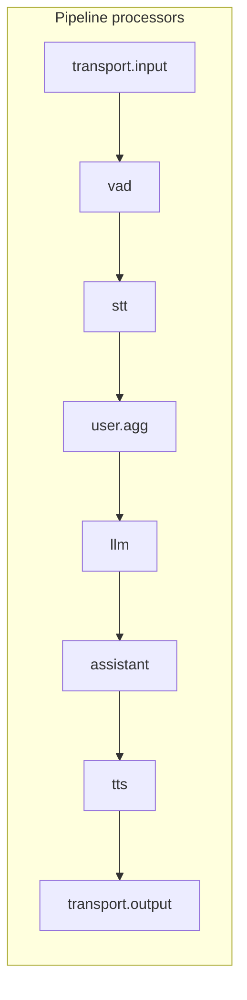

# llmpipe — Go reference

**llmpipe** is a Go library that models a **voice/LLM pipeline**: ordered **processors** exchange typed **frames** downstream (and optionally upstream). It is suited for **speech → STT → LLM → TTS → audio out**, with hooks for **barge-in**, **session idle**, and **async service callbacks** that **re-enter** the pipeline after a named processor.

Module path: `github.com/rohitdas13595/llmpipe` (see `go.mod` in the module root). Repository: [github.com/rohitdas13595/llmpipe](https://github.com/rohitdas13595/llmpipe).

---

## Mental model

1. You build a **linear pipeline** of `processor.Processor` values in the order frames should flow.
2. A **PipelineTask** receives frames (usually at index `0`) and walks the chain: each processor may call `emit.Down` / `emit.Up` zero or more times.
3. **Async work** (HTTP APIs, streaming LLM) does not block the whole chain forever: implementations call **`ReenterAfter(processorName, frame)`** on the task to push new frames **starting after** the processor that produced them.
4. **Runner** blocks until the task’s context is cancelled (optional SIGINT wiring).



Typical **voicebot** order (as in `cmd/voicebot/main.go`):

`userIdle` → `ws.input` → `vad` → `stt` → `userAgg` → `llm` → `assistant` → `tts` → `ws.output`

---

## Package map

| Package | Role |
|--------|------|
| `github.com/rohitdas13595/llmpipe/pipeline` | `Pipeline`, `PipelineTask`, `Runner`, task options |
| `github.com/rohitdas13595/llmpipe/processor` | `Processor` interface, `Direction`, `Emit`, `Func` adapter |
| `github.com/rohitdas13595/llmpipe/frames` | All frame types and `Frame` marker interface |
| `github.com/rohitdas13595/llmpipe/services` | `LLM`, `STT`, `TTS` type aliases + `ReenterFunc` |
| `github.com/rohitdas13595/llmpipe/aggregate` | `LLMContext`, `UserAggregator`, `AssistantAggregator`, `BotState` |
| `github.com/rohitdas13595/llmpipe/observe` | `FrameObserver`, `IdleFrameObserver` |
| `github.com/rohitdas13595/llmpipe/transcriptions` | BCP 47 language codes + `ResolveLanguage` (Pipecat `transcriptions/language.py`) |
| `github.com/rohitdas13595/llmpipe/transport/base` | `Params` — subset of Pipecat `TransportParams` |
| `github.com/rohitdas13595/llmpipe/transport/ws` | WebSocket PCM in/out |
| `github.com/rohitdas13595/llmpipe/transport/websocket/server` | Aliases to `transport/ws` (Pipecat “websocket server”) |
| `github.com/rohitdas13595/llmpipe/transport/websocket/client` | Outbound WebSocket PCM client (`Connect` + read loop) |
| `github.com/rohitdas13595/llmpipe/transport/livekit` | LiveKit room: Opus mic → PCM queue, TTS → published PCM |
| `github.com/rohitdas13595/llmpipe/transport/local` | PCM over `io.Reader` / `io.Writer` + `StartInput` |
| `github.com/rohitdas13595/llmpipe/transport/whatsapp` | Graph Calling API + webhook verify / HMAC |
| `github.com/rohitdas13595/llmpipe/transport/tavus` | Tavus REST v2 (`Client`) |
| `github.com/rohitdas13595/llmpipe/transport/lemonslice` | LemonSlice session REST |
| `github.com/rohitdas13595/llmpipe/transport/heygen` | HeyGen interactive streaming REST (`streaming.new` / `start` / `stop`) |
| `github.com/rohitdas13595/llmpipe/transport/smallwebrtc` | `NewPeerConnection` ICE helper (Pion) |
| `github.com/rohitdas13595/llmpipe/audio/vad` | VAD `Analyzer` + `Processor` |
| `github.com/rohitdas13595/llmpipe/audio/interrupt` | Barge-in `Strategy` |
| `github.com/rohitdas13595/llmpipe/audio/turn` | Placeholder for smart-turn / end-of-utterance |
| `github.com/rohitdas13595/llmpipe/processors/idle` | User idle timer processor |
| `github.com/rohitdas13595/llmpipe/processors/tools` | Reserved for tool/function-call wiring |
| `github.com/rohitdas13595/llmpipe/services/*` | Provider-specific STT/LLM/TTS processors |
| `github.com/rohitdas13595/llmpipe/providers` | Env-based provider wiring; Pipecat mapping in [`PROVIDERS.md`](PROVIDERS.md) |

---

## Core types

### `processor.Processor`

Every stage implements:

```go
type Processor interface {
    Name() string
    Process(ctx context.Context, f frames.Frame, dir Direction, emit Emit) error
}
```

- **`Direction`**: `Downstream` (normal forward flow) or `Upstream` (less common; reverse flow).
- **`Emit`**: callbacks to the next/previous processor:
  - `emit.Down(frame)` → index `i+1`
  - `emit.Up(frame)` → index `i-1`

**`processor.Func`**: wrap a function as a processor with a fixed `Name`.

### `pipeline.Pipeline`

- **`NewPipeline(processors ...processor.Processor) *Pipeline`**
- **`Processors() []processor.Processor`** — used internally by the task.

Order matters: that slice is the execution order.

### `pipeline.PipelineTask`

Orchestrates frame flow and optional observers.

**Construction**

- **`NewPipelineTask(p *Pipeline, opts ...TaskOption)`**

**Options**

- **`WithObservers(obs ...observe.FrameObserver)`** — e.g. logging, metrics.
- **`WithIdleObserver(idle *observe.IdleFrameObserver)`** — session idle watchdog; also registered as an observer.

**Injection & control**

- **`QueueFrames(ctx, []frames.Frame)`** — start processing at processor `0` downstream.
- **`StartSession(ctx, *frames.StartFrame)`** — convenience: queues a single start frame.
- **`Reenter(ctx, afterIdx int, f frames.Frame)`** — continue **downstream** from `afterIdx+1` (async callbacks).
- **`ReenterAfter(ctx, processorName string, f frames.Frame)`** — resolve name → index, then `Reenter`.
- **`ProcessorIndex(name string) int`** — `-1` if unknown.

**Lifecycle**

- **`Run(ctx)`** — blocks until `ctx` is done; starts idle observer if configured; stores internal cancel.
- **`Cancel()`** — idempotent cancel for the task context.

**Observers**: before each `Process`, the task calls `OnFrame(FramePushed)` on every observer with frame, direction, processor name, and index.

### `pipeline.Runner`

- **`NewRunner(handleSigint bool)`**
- **`Run(ctx, task)`** — if `handleSigint`, SIGINT/SIGTERM call `task.Cancel()` and cancel a derived context; then `task.Run`.

---

## Frames (`github.com/rohitdas13595/llmpipe/frames`)

All frames implement:

```go
type Frame interface {
    FrameKind() string
}
```

Constants like `KindStart`, `KindInputAudio`, `KindTranscription`, `KindLLMRun`, etc. identify kinds for observers and idle reset logic.

**Session / control**

| Type | Purpose |
|------|---------|
| `StartFrame` | Sample rate + channels |
| `EndFrame`, `CancelFrame` | Lifecycle |
| `ErrorFrame`, `FatalErrorFrame` | Non-fatal / fatal errors |

**Audio**

| Type | Purpose |
|------|---------|
| `InputAudioRawFrame` | PCM chunks (e.g. s16le mono) |
| `TTSAudioRawFrame` | TTS output PCM for transport |

**Speech / text**

| Type | Purpose |
|------|---------|
| `TranscriptionFrame`, `InterimTranscriptionFrame` | STT output |
| `TextFrame` | Plain text toward TTS |
| `LLMTextFrame` | Streaming LLM tokens |
| `LLMRunFrame` | “Run the LLM now” (user text already in context) |
| `LLMMessagesAppendFrame` | Extend chat without full run |

**Turn-taking / bot state**

| Type | Purpose |
|------|---------|
| `UserStartedSpeakingFrame`, `UserStoppedSpeakingFrame` | Utterance boundaries |
| `VADUserStartedSpeakingFrame`, `VADUserStoppedSpeakingFrame` | VAD-specific markers |
| `InterruptionFrame` | Barge-in |
| `BotStartedSpeakingFrame`, `BotStoppedSpeakingFrame` | Bot speech lifecycle |
| `BotSpeakingFrame` | “bot is outputting audio” (idle reset) |
| `LLMFullResponseStartFrame`, `LLMFullResponseEndFrame` | Delimit one assistant reply |

**Tools (reserved)**

| Type | Purpose |
|------|---------|
| `LLMSetToolsFrame` | Provider-specific tool schema |
| `FunctionCallResultFrame` | Tool results |

---

## Services contract (`github.com/rohitdas13595/llmpipe/services`)

```go
type LLM interface { processor.Processor }
type STT interface { processor.Processor }
type TTS interface { processor.Processor }

type ReenterFunc func(ctx context.Context, afterProcessorName string, f frames.Frame) error
```

Async processors (streaming LLM, batch STT) take a **`ReenterFunc`** closure that must be wired to **`PipelineTask.ReenterAfter`** (or `Reenter`) so tokens/transcripts/errors rejoin the pipeline **after** that processor’s slot.

Example pattern from `cmd/voicebot/main.go`:

```go
var task *pipeline.PipelineTask
reenter := func(ctx context.Context, name string, f frames.Frame) error {
    if task == nil {
        return nil
    }
    return task.ReenterAfter(ctx, name, f)
}
// pass reenter to NewSTT / NewLLM / NewTTS constructors that need it
```

Processor **`Name()`** must match the string passed to `Reenter` (e.g. `"stt"`, `"llm"`).

---

## Aggregators (`github.com/rohitdas13595/llmpipe/aggregate`)

### `LLMContext`

Thread-safe message list as `[]map[string]any` (OpenAI-style `role` / `content`).

- **`NewLLMContext(systemPrompt string)`**
- **`AppendUser` / `AppendAssistant`**
- **`Snapshot()`** — copy for LLM calls

### `BotState`

Atomic flag: is the bot currently speaking? Used for **echo suppression** (STT ignoring mic while TTS plays) and **interrupt strategies**.

### `UserAggregator`

- On **`InterimTranscriptionFrame`**: optional interrupt via strategy; forwards frame.
- On **`TranscriptionFrame`**: appends user text to `LLMContext`, emits **`LLMRunFrame`** downstream.

### `AssistantAggregator`

- Maps **`LLMTextFrame` → `TextFrame`** for TTS (chunk-wise).
- On **`LLMFullResponseEndFrame`**, commits full assistant text to `LLMContext`.
- Resets partial buffer on interruption / response start.

---

## Audio helpers

### VAD (`github.com/rohitdas13595/llmpipe/audio/vad`)

- **`Analyzer`** — `Analyze(pcm16, sampleRate) (started, stopped bool)`.
- **`EnergyAnalyzer`** — RMS threshold MVP (tunable threshold / min speech / silence **frames**). If **`SilenceStopMS` > 0**, end-of-speech uses **milliseconds** of sub-threshold audio after talk (Pipecat `stop_secs`–style); env **`TURN_SILENCE_MS`** in voicebot sets this.
- **`Processor`** — on `InputAudioRawFrame`, emits VAD/user start/stop frames and forwards PCM.

### Interrupt (`github.com/rohitdas13595/llmpipe/audio/interrupt`)

- **`Strategy`** — `ShouldInterrupt(transcript, botSpeaking bool)`.
- **`NoInterrupt`**, **`MinWords{N}`** — e.g. barge-in after N words while bot speaks.

### Turn (`github.com/rohitdas13595/llmpipe/audio/turn`)

- **`SilenceAnalyzer`** — `AppendAudio(pcm, sampleRate, isSpeech) State` for tests or custom stacks (default **3000 ms** stop unless overridden); mirrors Pipecat silence leg of smart-turn.
- **`TrackingProcessor`** — inserts **`TurnStartedFrame`** / **`TurnEndedFrame`** (with `Complete` false on **`InterruptionFrame`**) after VAD; enable in voicebot with default **`TURN_TRACK=1`**, disable with `TURN_TRACK=0`.
- **`EndOfTurnML`** — reserved interface for future ML smart-turn models.

---

## Observers (`github.com/rohitdas13595/llmpipe/observe`)

- **`FrameObserver`** / **`FuncObserver`** — tap every frame at each processor.
- **`IdleFrameObserver`** — if no “activity” frames for `Timeout`, runs `OnIdle`; optional `CancelOnIdle`. **`DefaultIdleResetKinds()`** includes `BotSpeaking`, user/bot started speaking kinds.

Use **`pipeline.WithIdleObserver`** so `Start`/`Stop` align with `task.Run`.

---

## Transcriptions (`github.com/rohitdas13595/llmpipe/transcriptions`)

- **`Language`** — string alias for BCP 47 tags; constants in **`language_constants.go`** track Pipecat `Language` (updated manually when needed).
- **`ResolveLanguage(lang, map[Language]string, useBaseCode)`** — same behavior as Pipecat `resolve_language` (map lookup, then base subtag or full tag with slog warnings).

---

## Serializers (`github.com/rohitdas13595/llmpipe/serializers`)

Pipecat uses `FrameSerializer` with protobuf (`frames.proto`) and provider-specific serializers. llmpipe provides:

- **`Serializer`** — `Serialize(Frame) ([]byte, error)`, `Deserialize([]byte) (Frame, error)`.
- **`Protobuf`** — binary compatible with Pipecat `ProtobufFrameSerializer` / `pipecat.frames.protobufs.frames_pb2` (same `Frame` oneof: text, audio, transcription, message). Regenerate with **`go generate`** in `serializers/pipecatpb/`. Audio on deserialize becomes **`InputAudioRawFrame`** (Python does the same for inbound audio).
- **`JSON`** — tagged JSON for debugging or custom gateways (`kind` discriminator, base64 audio for `input_audio` / `tts_audio`).

Default WebSocket transport still sends **raw PCM** for TTS and receives raw PCM for mic input; use serializers when building gateways that must match Pipecat’s protobuf WebSocket framing.

---

## Transports

Pipecat layout includes Daily (not ported here). llmpipe ships **WebSocket server** (`transport/ws`, aliased by `transport/websocket/server`), **WebSocket client** (`transport/websocket/client`), **LiveKit**, **local PCM I/O** (`transport/local`), **WhatsApp** Calling API + webhook helpers, **Tavus** / **LemonSlice** / **HeyGen** HTTP clients, and a **smallwebrtc** Pion `PeerConnection` bootstrap. Tavus/LemonSlice/HeyGen Python transports combine these APIs with Daily/WebRTC media; wire **`Client`** results into **`transport/livekit`** or **`websocket/client`** when you have a room/WebSocket URL. Shared **`transport/base.Params`** mirrors a subset of Pipecat `TransportParams`.

### WebSocket (`github.com/rohitdas13595/llmpipe/transport/ws`)

- **`NewTransport(sampleRate, queue func(ctx, []frames.Frame) error)`** — `queue` should be `task.QueueFrames`. Optional **`OnDisconnect`** runs when the WebSocket closes (end session / cancel task).
- **`Input()`** — passthrough (audio enters via `queue` from `HandleWebSocket`).
- **`HandleWebSocket`** — upgrades connection, sends `StartFrame`, reads binary PCM as `InputAudioRawFrame`; text control JSON `{"endUtterance":true}` or `end` → `UserStoppedSpeakingFrame`.
- **`Output()`** — writes `TTSAudioRawFrame` as binary WebSocket messages (serialized writes).

### WebSocket client (`github.com/rohitdas13595/llmpipe/transport/websocket/client`)

- **`NewTransport(sampleRate, url, queue)`** — set **`Header`** / **`Dialer`** as needed.
- **`Connect(ctx)`** — dials **`URL`**, queues **`StartFrame`**, runs read loop (binary PCM + same text control as server transport).
- **`Input()` / `Output()` / `Close()`** — same roles as `transport/ws`.

### Local (`github.com/rohitdas13595/llmpipe/transport/local`)

- **`NewTransport(sampleRate, in io.Reader, out io.Writer, queue)`** — `In` optional; **`StartInput(ctx)`** reads fixed chunks into **`InputAudioRawFrame`** until EOF; **`Out`** receives **`TTSAudioRawFrame`** bytes (wrap PortAudio / stdin yourself).

### WhatsApp (`github.com/rohitdas13595/llmpipe/transport/whatsapp`)

- **`VerifyWebhookChallenge` / `VerifyWebhookChallengeInt`**, **`ValidateSignature`** (raw body + `X-Hub-Signature-256`).
- **`NewAPI(token, phoneNumberID).AnswerCall` / `RejectCall` / `TerminateCall`** — Graph **`v23.0`** `/{phone-number-id}/calls`.

### Tavus / LemonSlice / HeyGen (HTTP)

- **`tavus.Client`** — **`CreateConversation`**, **`EndConversation`**, **`GetPersona`**; optional dev room via **`TAVUS_SAMPLE_ROOM_URL`**.
- **`lemonslice.Client`** — **`CreateSession`**, package **`EndSession`**.
- **`heygen.Client`** — **`NewInteractiveSession`** / **`CloseSession`** (`api.heygen.com/v1` streaming API).

### Small WebRTC (`github.com/rohitdas13595/llmpipe/transport/smallwebrtc`)

- **`NewPeerConnection(iceURLs []string)`** — Pion peer with STUN/TURN URL list; add tracks and SDP in your app.

### LiveKit (`github.com/rohitdas13595/llmpipe/transport/livekit`)

- **`NewTransport(url, ConnectInfo, sampleRate, queue, logger, connectOpts...)`** — optional SDK options (e.g. **`ConnectOptionsFromEnv()`** for timeout / region / ICE). Optional **`OnDisconnect`** when a remote participant leaves or the room disconnects (not fired for intentional **`Transport.Disconnect`**).
- **`Connect(ctx)`** — join room, publish PCM local track, subscribe first remote Opus mic → decode to PCM → `InputAudioRawFrame` via `queue`.
- **`Input()` / `Output()`** — passthrough in; TTS PCM → `PCMLocalTrack.WriteSample`.
- **`Disconnect()`** — cleanup.

---

## Processors / idle (`github.com/rohitdas13595/llmpipe/processors/idle`)

**`UserProcessor`** — after conversation starts, resets a timer on user/bot activity; on timeout calls **`UserCallback(retryCount) (continueMonitoring bool)`**.

---

## Provider implementations (summary)

| Provider | STT | LLM | TTS | Notes |
|----------|-----|-----|-----|--------|
| Deepgram | ✅ prerecorded on utterance end | — | — | Uses `ReenterFunc`; optional `BotState` to skip buffering while bot speaks |
| OpenAI | — | ✅ streaming HTTP | — | `ReenterFunc` for tokens / boundaries |
| Google (GenAI) | ⚠️ placeholder pass-through | ✅ streaming | ✅ | STT stub; LLM uses `google.golang.org/genai` |
| AWS | stubs / partial | — | partial | Check package for current behavior |
| ElevenLabs | — | — | ✅ | PCM for pipeline |
| Sarvam | ✅ | — | ✅ | API-key based |

Always read the specific `services/<provider>/*.go` file for env vars and exact frame handling.

---

## Using llmpipe in your own project

### 1. Add the module

From your application module root:

```bash
go get github.com/rohitdas13595/llmpipe@latest
```

**Local checkout** (monorepo or working copy next to your app): add a `replace` so builds use that directory instead of the proxy:

```go
// go.mod
require github.com/rohitdas13595/llmpipe v0.0.0
replace github.com/rohitdas13595/llmpipe => ../llmpipe   // adjust path
```

Or vendor/copy the module tree and set `replace` to that path.

### 2. Minimal skeleton

```go
ctx := aggregate.NewLLMContext("You are a helpful assistant.")
bot := aggregate.NewBotState()

var task *pipeline.PipelineTask
reenter := func(c context.Context, name string, f frames.Frame) error {
    if task == nil {
        return nil
    }
    return task.ReenterAfter(c, name, f)
}

stt := deepgram.NewSTT("stt", os.Getenv("DEEPGRAM_API_KEY"), reenter, 16000, bot)
llm := openai.NewLLM("llm", os.Getenv("OPENAI_API_KEY"), "gpt-4o-mini", ctx, reenter)
tts := elevenlabs.NewTTS("tts", os.Getenv("ELEVENLABS_API_KEY"), os.Getenv("ELEVENLABS_VOICE_ID"), bot, 16000)

userAgg := aggregate.NewUserAggregator("user.agg", ctx, bot, interrupt.MinWords{N: 1})
asst := aggregate.NewAssistantAggregator("assistant", ctx)
vadP := vad.NewProcessor("vad", nil)

tr := ws.NewTransport(16000, func(c context.Context, ff []frames.Frame) error {
    return task.QueueFrames(c, ff)
})

p := pipeline.NewPipeline(
    tr.Input(),
    vadP,
    stt,
    userAgg,
    llm,
    asst,
    tts,
    tr.Output(),
)
task = pipeline.NewPipelineTask(p)

go http.ListenAndServe(":8080", nil) // plus tr.HandleWebSocket on your route

rootCtx, cancel := context.WithCancel(context.Background())
defer cancel()
_ = pipeline.NewRunner(true).Run(rootCtx, task)
```

Adjust processors (idle, observers, LiveKit instead of WS) as needed.

### 3. Custom processor

```go
type MyProc struct{}

func (MyProc) Name() string { return "mine" }

func (MyProc) Process(ctx context.Context, f frames.Frame, dir processor.Direction, emit processor.Emit) error {
    switch f.(type) {
    case *frames.TextFrame:
        // inspect / rewrite
    }
    emit.Down(f)
    return nil
}
```

Register it in the pipeline slice where it should run.

### 4. Async pattern

Inside a goroutine after I/O completes:

```go
_ = reenter(ctx, "myproc", &frames.TextFrame{Text: result})
```

Ensure **`Name()`** of that processor is exactly `"myproc"` and **`reenter`** is bound to the same **`PipelineTask`** instance.

### 5. Dependencies

Core framing uses the standard library plus optional providers (e.g. `google.golang.org/genai`, LiveKit SDKs). Run `go mod tidy` in your app after wiring imports.

---

## Reference implementation

**`cmd/voicebot/main.go`** — full WebSocket demo: env-based STT/LLM/TTS selection, VAD thresholds, user idle, pipeline idle observer, static demo UI under `github.com/rohitdas13595/llmpipe/examples` (embedded HTML).

**`cmd/voicebot-livekit/main.go`** — LiveKit variant (if present in your tree).

---

## Design notes

- **Linear pipeline** + **recursive emit** implements a push model: each processor forwards frames by calling emit callbacks.
- **Re-enter** lets async work push new frames back into the task starting after the processor that produced them.
- Frame kinds and names (`LLMRunFrame`, `InterruptionFrame`, etc.) reflect common voice/LLM pipeline stages.

---

## Version and Go

See **`go.mod`** for the Go toolchain version and direct module dependencies. Tag releases as `vMAJOR.MINOR.PATCH` on GitHub so consumers can pin versions (e.g. `@v0.1.0`).
